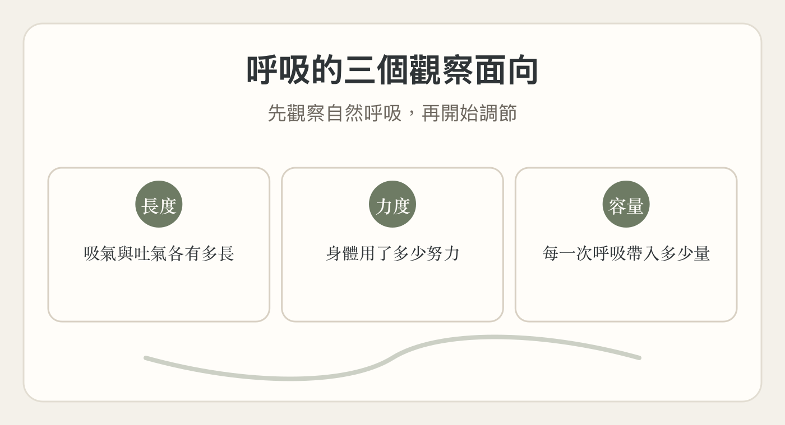
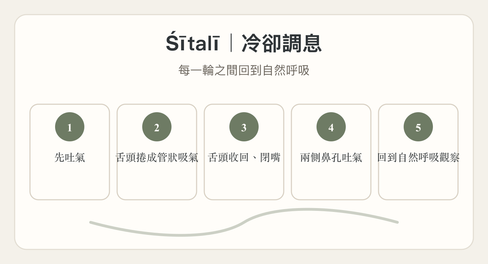

# 課後複習筆記｜從體位法到調息：觀察身體，調節呼吸

- 授課老師：Nandaji

- 日期：2026/07/26

- 時間：10:30–12:30、13:30–15:30

- 地點：新莊禪圓瑜珈

## 課堂主題

這一天從體位法一路進入 Prāṇāyāma｜調息法。

上午以倒立、前彎、Adho Mukha Śvānāsana｜下犬式等練習，觀察身體位置、左右差異與整體身體條件；下午再把注意力帶到呼吸，從自然呼吸的觀察開始，進一步練習延長與調節。

整天的複習主線可以記成：

**身體的位置與條件改變

→ 循環與呼吸也會改變

→ 觀察自然呼吸

→ 看長度、力度、容量

→ 延長呼吸，同時減少不必要的用力

→ 進入調息技巧

→ 回到自然呼吸**

---

## 一、體位改變，整個身體條件也跟著改變

平常直立時，頭與心臟有固定的相對位置；當身體前彎，或進入倒立類姿勢時，身體所處的條件會改變。

姿勢帶來的作用，也和每個人的身體與生理狀態有關，例如：

- 肌肉的狀態

- 關節與韌帶

- 活動度

- 呼吸系統

- 循環系統

因此，同一個姿勢在不同的人身上，感受與反應可能不同。

---

## 二、Śīrṣāsana｜頭倒立與 Sarvāṅgāsana｜肩立

課堂中談到：

- **Śīrṣāsana｜頭倒立**：老師以「王／父親」來形容。

- **Sarvāṅgāsana｜肩立**：老師以「后／母親」來形容。

這兩類倒立的重點不只在姿勢外形，而在於它們對整個身體系統所帶來的作用。

練習時依自己的程度選擇合適版本：

- 已有頭倒立經驗者，練習自己熟悉的版本。

- 尚未練習頭倒立者，可用 **Adho Mukha Śvānāsana｜下犬式**等方式替代。

**不需要為了跟別人做一樣的姿勢，而超出自己目前可以穩定完成的範圍。**

---

## 三、左右不平衡，要回頭找準備條件

在體位法裡，一邊容易、一邊困難很常見。差異可能來自：

- 腿的工作

- 骨盆的位置

- 肩膀與手臂的控制

- 左右兩側的活動度與穩定度

如果在 **Śīrṣāsana｜頭倒立**中發現左右不平衡，不一定只在頭倒立裡反覆調整。

可以回到：

- 站姿

- 坐姿

- 腿與骨盆的準備

- 肩膀與手臂的準備

先把需要的條件建立起來，再回到頭倒立檢查。

**一個姿勢中看見的問題，可以透過其他姿勢來準備與改善。**

---

## 四、體位法需要活動度、柔軟度、穩定度與力量

體位法不只是追求柔軟或把身體「打開」。完整的練習同時需要：

- **活動度**

- **柔軟度**

- **穩定度**

- **力量**

肌肉與關節如果缺乏穩定，就難以形成平衡的動作。

流動、伸展與停留也各有作用。這些練習逐步準備脊椎、肌肉、韌帶與關節，讓身體能以較少的額外用力進入呼吸練習。

---

## 五、開始調息前，先觀察呼吸的三個面向

### 1｜長度

先看自然吸氣與吐氣各有多長。

不是先規定自己一定要吸幾拍、吐幾拍，而是先知道目前自然呼吸的長度。

### 2｜力度

觀察吸氣與吐氣時，身體需要多少力量或努力。

自然呼吸看起來好像「沒有用力」，其實肺的擴張與收縮、橫隔膜以及身體各個生理系統都持續在工作，只是這些工作大多不是刻意控制的。

### 3｜容量

即使兩個人吸氣的時間一樣，吸入的量也不一定相同。

每個人的身體條件、肺部能力、肌肉狀況與呼吸系統不同，因此呼吸的容量與深度也會不同。

### 複習重點

**長度、力度、容量**是三個不同的觀察面向。

先看清楚自己的自然呼吸，再開始調節。

---

## 六、呼吸延長，但不增加不必要的用力

調息練習不是單純追求「越長越好」。

課堂的方向是：

**呼吸逐漸延長

＋ 流動保持穩定

＋ 不必要的用力逐漸減少**

如果呼吸時間變長，身體卻越來越緊、越來越費力，就需要減少強度，回到可以平順維持的程度。

體位法所建立的活動度與穩定度，可以讓呼吸在延長時不必依賴過多力量。

---

## 七、比較體位法前後的呼吸

可以把「觀察呼吸」放進平常的體位法練習中。

### 體位法之前

先觀察：

- 長度

- 力度

- 容量

### 體位法之後

再觀察一次，看看三個面向有沒有改變。

也可以比較不同類型練習之後的差異，例如：

- 前彎之後

- 後彎之後

- 倒立之後

- 不同練習序列之後

透過持續比較，會逐漸看見身體狀態與呼吸之間的關係。

---

## 八、自我練習：先從重複課堂內容開始

剛開始自己練習時，不需要急著設計複雜的練習序列。

可以先：

- 重複課堂上學過的練習序列

- 記下當天做過的順序

- 不清楚時詢問老師當天的練習序列

課堂中舉例：如果一週到教室上課三次，可以另外至少安排兩次自己的練習。

自我練習時逐漸學會判斷：

- 今天身體是什麼狀態

- 哪些姿勢需要多停留

- 哪些姿勢需要少做

- 哪些準備動作能幫助後面的姿勢

- 練習前後，呼吸有什麼變化

---

## 九、身體、呼吸、感官與心念一起參與

跑步、健身、走路、登山都會對身體產生作用；瑜珈體位法還包含對整體狀態的覺察。

練習中要逐漸把以下幾個層面放在一起：

- 身體

- 生理系統

- Prāṇa｜生命能量

- 感官

- 心念

因此，不建議把看電視或聽音樂變成常態性的瑜珈練習背景。注意力需要回到正在發生的身體、呼吸與感受。

---

## 十、四區域呼吸覺察

這個練習可以在 **Śavāsana｜大休息式**中進行。

覺察依序帶到四個區域：

### ① 胸腔

先感覺胸腔的範圍。

吸氣到胸腔的感受，吐氣從胸腔的感受。做數次後，回到自然呼吸。

### ② 橫隔膜／上腹部

讓覺察再往下到橫隔膜與上腹部。

吸氣、吐氣的長度可能自然比前一階段增加。

做數次後，再回到自然呼吸。

### ③ 腹部／肚臍區域

把注意力帶到：

- 肚臍中央

- 左右腹部

- 後側肋骨

- 脊椎周圍的活動

觀察吸氣與吐氣時，這些區域如何變化。

### ④ 骨盆／骨盆底

最後把覺察帶到：

- 骨盆

- 前側髖部

- 恥骨

- 鼠蹊

- 臀部

- 骨盆底

這一階段的吸氣與吐氣可以比前面更長。

### 重要提醒

**不是空氣真的進入腹部或骨盆底。**

這是一種覺察的方法。肺部擴張、橫隔膜活動、腹部與骨盆底之間會產生連鎖反應，練習時去感受這些細微的活動。

每完成一組後，都先回到自然呼吸，等待一下，再進下一組。

---

## 十一、Śītalī｜冷卻調息

### 坐姿準備

- 坐在適當高度的支撐上。

- 鼠蹊、髖與腿部不要有明顯僵硬或卡住。

- 頭、頸、脊椎保持整體對齊。

- 先讓自然呼吸安靜、平順。

### 一輪練習

- 先吐氣。

- 把舌頭捲成管狀。

- 由捲起的舌頭緩慢、穩定地吸氣。

- 吸氣完成後，舌頭回到口腔內。

- 閉上嘴巴。

- 從兩側鼻孔緩慢、穩定地吐氣。

- 回到自然呼吸，等待並觀察。

### 練習時注意

**不要一輪接一輪不停地做。**

每一輪後回到自然呼吸，觀察：

- 舌頭

- 口腔

- 臉部

- 坐姿

- 整體呼吸狀態

課堂中約練習 **6–8 次**。

---

## 十二、Bhrāmarī｜蜂鳴調息

Bhrāmarī 的特徵是在吐氣時產生蜂鳴般的聲音。

呼吸中的聲音是一種練習技巧，但不是所有呼吸都需要一直有聲音。

練習時仍然回到幾個基本原則：

- 呼吸平順

- 長度可以逐漸增加

- 節奏保持穩定

- 身體不要增加不必要的用力

- 注意力留在呼吸與聲音的感受上

---

## 十三、最後回到自然呼吸

經過體位法、倒立、呼吸觀察、四區域呼吸、Śītalī 與 Bhrāmarī 後，最後回到自然呼吸。

這時不需要再刻意增加技巧或控制，只觀察現在的呼吸與身體狀態。

整天可以用這三句話複習：

> **體位法準備身體。
> 
> 先觀察呼吸，再開始調節。
> 
> 呼吸延長時，讓不必要的用力逐漸減少。**

---

## 老師建議的日常練習

- 體位法前先觀察自然呼吸的**長度、力度、容量**。

- 體位法後再觀察一次，做前後比較。

- 比較前彎、後彎、倒立或不同練習序列之後的呼吸變化。

- 初期自我練習可直接重複課堂的練習序列。

- 四區域呼吸覺察可以在 **Śavāsana｜大休息式**中練習。

- Śītalī 每一輪之間都回到自然呼吸，不連續硬做。

- 練習中持續觀察左右差異，以及身體、呼吸與心念的變化。

---

## 全天複習主線

**前彎與倒立

→ Śīrṣāsana｜頭倒立／Sarvāṅgāsana｜肩立

→ Adho Mukha Śvānāsana｜下犬式與準備

→ 左右差異與身體條件

→ 活動度、柔軟度、穩定度、力量

→ 自然呼吸

→ 長度／力度／容量

→ 四區域呼吸覺察

→ Śītalī｜冷卻調息

→ Bhrāmarī｜蜂鳴調息

→ 回到自然呼吸**
